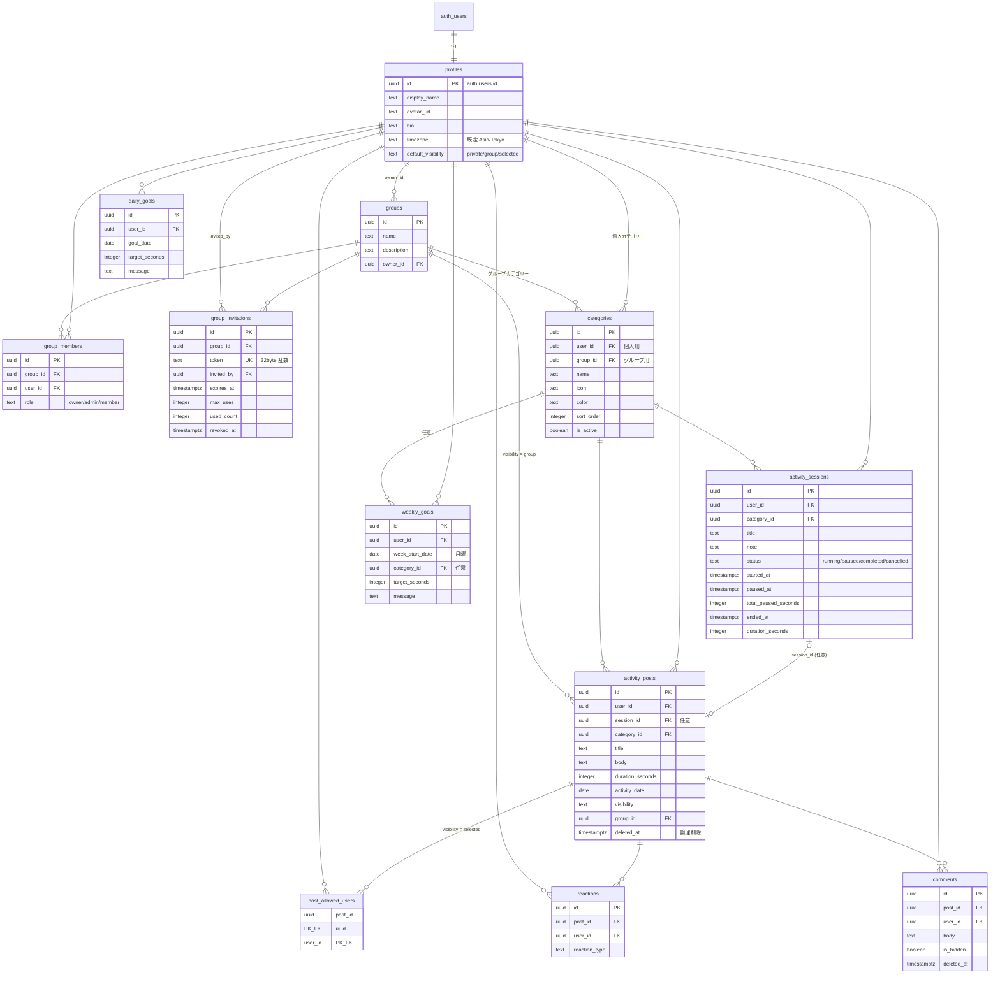

# Hearth Growth 設計メモ

要件定義書に対する実装側の設計をまとめたものです。
実装が要件と食い違うときは、まずこのファイルを直してから実装します。

---

## 1. 技術構成

| 層             | 採用                                                      | 理由                                                                 |
| -------------- | --------------------------------------------------------- | -------------------------------------------------------------------- |
| フロントエンド | Next.js 16 (App Router) / React 19 / TypeScript strict    | Server Components でサーバー処理とクライアント処理を自然に分離できる |
| スタイル       | Tailwind CSS v4                                           | 設定ファイルなしで CSS 変数によるテーマ管理ができる                  |
| UI 部品        | 自前の最小コンポーネント（shadcn/ui 相当の構成）          | MVP に必要な数点だけ。ライブラリ全体は入れない                       |
| フォーム       | React Hook Form + Zod                                     | 入力検証のスキーマをサーバー側と共有する                             |
| DB / 認証      | Supabase (PostgreSQL, Auth, Realtime, Storage)            | RLS を権限判定の唯一の正にできる                                     |
| テスト         | Vitest + React Testing Library（+ Playwright は Phase 8） | 単体・結合を速く回す                                                 |
| デプロイ       | Vercel + Supabase                                         | —                                                                    |

**状態管理**: グローバルストアは入れません。サーバーから取れるものは Server Component で取り、
クライアント状態はタイマー画面など必要な場所だけに閉じ込めます。
TanStack Query は Phase 5（タイムラインの追加読み込み）で必要になった時点で判断します。

### 既存リポジトリとの関係

このリポジトリのルートには Discord ベースのライフログ Bot（`hearth-life`, Python）があります。
別プロダクトなので、Next.js アプリは `hearth-growth/` 配下に閉じ込め、依存も設定も混ぜていません。

---

## 2. アーキテクチャ方針

```
ブラウザ
  └─ Server Component（表示）
       └─ Server Action / Route Handler（更新）
            └─ Supabase クライアント（anon key + ユーザーの JWT）
                 └─ PostgreSQL + RLS ← 権限判定はここが唯一の正
```

- **権限判定を二重に持たない。** 画面側の出し分けは体験のためであり、権限ではありません。
  `visibility` の判定は `can_view_post()` に集約し、UI 側の関数はラベル表示だけを担当します。
- **service role key は使いません。** RLS を迂回する経路を作らないためです。
  やむを得ず必要になった場合も、ブラウザから到達できないサーバー専用環境にだけ置きます。
- **サーバーでは `getSession()` を使わず `getUser()` を使います。** 前者は Cookie を検証しないためです。
- **`user_id` はクライアントから受け取りません。** 常に `auth.uid()` をサーバー側で取得します。
- **秒数をクライアントで保持しません。** タイマー表示は常に `started_at` からの再計算です（13.1）。
- **ロジックと画面を分けます。** 計算は `src/lib/`、データ取得と更新は `src/features/<機能>/`、
  表示は `src/components/` に置き、`page.tsx` には組み立てだけを書きます。

---

## 3. ER 図



---

## 4. テーブル定義

正確な定義は [`../supabase/migrations/0001_initial_schema.sql`](../supabase/migrations/0001_initial_schema.sql) です。
要件定義書からの追加・変更点だけをここに記します。

| 箇所                              | 変更                                                                                               | 理由                                                            |
| --------------------------------- | -------------------------------------------------------------------------------------------------- | --------------------------------------------------------------- |
| 列挙値                            | enum 型ではなく `text` + CHECK 制約                                                                | 要件定義書の型指定に合わせつつ、値の追加を軽くするため          |
| `group_invitations.revoked_at`    | 追加                                                                                               | 12.2「招待リンク無効化」を、行を消さずに表現するため            |
| `comments.is_hidden`              | 追加                                                                                               | 10.2「投稿者がコメントを非表示にできる」を表現するため          |
| `activity_sessions` の CHECK      | `paused` のときだけ `paused_at` を持つ／`completed` は `ended_at` と `duration_seconds` を必ず持つ | 状態と列の整合を DB 側で保証するため                            |
| `activity_posts` の CHECK         | `visibility = 'group'` のときだけ `group_id` を持つ                                                | 公開先の指定漏れ・付け過ぎを防ぐため                            |
| `activity_posts.session_id`       | UNIQUE                                                                                             | 1つのセッションから投稿が二重生成されるのを防ぐため             |
| `activity_posts.duration_seconds` | 上限 24 時間                                                                                       | 手動入力の桁間違いを弾くため                                    |
| `weekly_goals.week_start_date`    | 月曜日のみ許可する CHECK                                                                           | 15.2 の週の定義をデータ側でも固定するため                       |
| 初期カテゴリー                    | `handle_new_user` トリガーで9件を自動作成                                                          | 8章。登録直後から何も設定せずタイマーを開始できるようにするため |

### インデックス（21章）

- `activity_posts`: `user_id` / `group_id` / `activity_date` / `created_at` / `category_id`、
  および集計用の複合部分インデックス `(user_id, activity_date desc) where deleted_at is null`
- `activity_sessions`: `(user_id, status)`、`started_at desc`、
  および二重起動防止の部分一意インデックス `(user_id) where status in ('running','paused')`
- `comments`: `(post_id, created_at)`、`reactions`: `post_id`

---

## 5. RLS 方針

一覧表は [`../supabase/policies/README.md`](../supabase/policies/README.md) に置いています。要点だけ再掲します。

1. すべての公開テーブルで RLS を有効化する。テーブル追加時の付け忘れは
   `src/tests/rls-coverage.test.ts` が検出する。
2. `group_members` を参照するポリシーは再帰するため、判定は `SECURITY DEFINER` 関数に切り出す。
   これらの関数は `search_path` を固定し、`anon` からの実行権限を剥奪する。
3. `profiles` はグループ外へ一切返さない（20章「グループ外ユーザーの情報を返さない」）。
4. `activity_sessions` は本人しか読めない。ホーム画面の「今、頑張っている人」は
   `get_active_group_members()` が必要な列だけを返す。**`title` と `note` は他人に返さない。**
5. コメントとリアクションは `can_view_post()` を通すことで、元投稿の公開範囲を超えない。
6. RLS では表現できない手続き（招待の受理、グループ作成、コメント非表示）だけを RPC にする。

---

## 6. 画面一覧

| 画面                                   | 内容                                                       | フェーズ |
| -------------------------------------- | ---------------------------------------------------------- | -------- |
| ログイン / 新規登録 / パスワード再設定 | メールアドレス認証                                         | 1        |
| 招待                                   | 招待リンクからの参加                                       | 2        |
| ホーム                                 | 今日の自分・今活動中の人・クイックアクション・タイムライン | 5, 7     |
| タイマー                               | 開始・一時停止・再開・終了・キャンセル                     | 3        |
| 活動終了                               | 時間確認・振り返り・公開範囲・投稿                         | 4        |
| タイムライン                           | 投稿一覧・リアクション・コメント                           | 5, 6     |
| 記録                                   | 手動記録・自分の記録一覧・編集・削除                       | 4        |
| マイページ                             | プロフィール・集計・連続記録・目標                         | 1, 7     |
| グループ                               | 一覧・詳細・招待・メンバー管理                             | 2        |
| 設定                                   | 表示名・画像・タイムゾーン・既定公開範囲・ログアウト       | 1, 4, 8  |

---

## 7. ルーティング一覧

| パス                     | 認証                     | 内容                                         |
| ------------------------ | ------------------------ | -------------------------------------------- |
| `/`                      | 必要                     | `/home` へリダイレクト                       |
| `/login`                 | 不要                     | ログイン                                     |
| `/signup`                | 不要                     | 新規登録                                     |
| `/reset-password`        | 不要                     | パスワード再設定                             |
| `/invite/[token]`        | 不要（参加はログイン後） | 招待の確認と参加                             |
| `/home`                  | 必要                     | ホーム                                       |
| `/timeline`              | 必要                     | タイムライン                                 |
| `/timer`                 | 必要                     | タイマー                                     |
| `/timer/finish`          | 必要                     | 活動終了（Phase 4 で追加）                   |
| `/activities`            | 必要                     | 記録一覧・手動記録                           |
| `/activities/[id]`       | 必要                     | 記録の詳細と編集（Phase 4 で追加）           |
| `/groups`                | 必要                     | グループ一覧                                 |
| `/groups/[id]`           | 必要                     | グループ詳細（Phase 2 で追加）               |
| `/profile`               | 必要                     | マイページ                                   |
| `/reset-password/update` | 再設定リンク経由         | 新しいパスワードの設定                       |
| `/auth/confirm`          | 不要                     | メール内リンクの受け口（確認・再設定・招待） |
| `/settings`              | 必要                     | 設定                                         |

認証の振り分けは `src/proxy.ts` で行います
（Next.js 16 で `middleware` は `proxy` に改称されました）。
ここでの判定は入口の振り分けであり、データの権限判定は RLS が行います。

---

## 8. Phase 別実装計画

| Phase | 内容                                                                       | 状態     |
| ----- | -------------------------------------------------------------------------- | -------- |
| 0     | プロジェクト基盤、DB スキーマ、RLS、共通レイアウト、テスト環境             | **完了** |
| 1     | 認証（登録・ログイン・再設定）、プロフィール編集、認証ガードの実配線       | **完了** |
| 2     | グループ作成・招待リンク発行と失効・招待からの参加・メンバー管理           | **完了** |
| 3     | カテゴリー管理、タイマー（開始／一時停止／再開／終了／復元／二重起動防止） | 未着手   |
| 4     | タイマーからの投稿、手動記録、編集・論理削除、公開範囲                     | 未着手   |
| 5     | タイムライン（ページネーション）、活動中メンバー表示                       | 未着手   |
| 6     | リアクション、コメント                                                     | 未着手   |
| 7     | 今日・今週・カテゴリー別集計、連続記録日数、週間目標                       | 未着手   |
| 8     | RLS の統合テスト、E2E、空状態・エラー・ローディング、PWA、アクセシビリティ | 未着手   |

Phase 0 で DB スキーマと RLS を先に固めたのは、要件定義書 25 章
「データベース設計を先に固める」「RLS を後回しにしない」に沿うためです。
Phase 1 以降は、この土台の上に画面を足していきます。

---

## 9. 想定されるリスク

| リスク                                       | 影響                           | 対応                                                                                                          |
| -------------------------------------------- | ------------------------------ | ------------------------------------------------------------------------------------------------------------- |
| RLS の書き漏れで非公開投稿が漏れる           | 致命的                         | ポリシー判定を `can_view_post()` に集約。付け忘れは静的テストで検出。Phase 8 で実 DB に対する統合テストを追加 |
| `group_members` を参照するポリシーの無限再帰 | 全 API が失敗                  | 判定を `SECURITY DEFINER` 関数へ切り出し済み                                                                  |
| `SECURITY DEFINER` 関数の権限昇格            | 重大                           | `search_path` 固定、`anon` の実行権限剥奪、関数内で `auth.uid()` を必ず検証                                   |
| タイマーの二重起動                           | データ不整合                   | 部分一意インデックスで DB 側が拒否。UI 側はそのエラーを拾って案内する                                         |
| 端末時計のずれ                               | 経過時間が狂う／負になる       | 表示は常に `started_at` からの再計算。負の値は 0 で下げ止め。確定値はサーバー時刻（`now()`）で決める          |
| 長時間放置されたタイマー                     | 数十時間の記録が生まれる       | 12 時間で「異常終了の疑い」と判定し、次回ログイン時に確認を出す。自動終了はしない（13.4）                     |
| タイムゾーンと夏時間                         | 「今日」「今週」の集計がずれる | 日付計算は `profiles.timezone` 基準。夏時間の切り替え日を含めてテスト済み                                     |
| 招待リンクの漏洩                             | 部外者の参加                   | 32byte 乱数、期限、利用上限、失効。参加は `accept_invitation()` でのみ可能                                    |
| `?next=` を使ったオープンリダイレクト        | 認証情報の詐取                 | `safeRedirectPath()` で自サイト内のパスだけを許可。ログイン・確認リンクの両方で共通に使う                     |
| 認証エラー文の逆用（利用者の存在確認）       | 情報漏れ                       | 対応表にあるコードだけを日本語化し、それ以外は一律の文言。パスワード再設定は成否に関わらず同じ応答を返す      |
| 「今活動中」表示による意図しない共有         | 心理的負担                     | 他人に返すのはカテゴリーと経過時間だけ。タイトルとメモは返さない                                              |
| リアクション数が競争を生む                   | プロダクト思想と矛盾           | 1投稿1リアクション、数値を強調しない表示、ランキングを作らない                                                |
| 機能を増やしすぎて日常利用に耐えなくなる     | MVP の失敗                     | Phase 単位で完成させ、5.2「含めない機能」を守る                                                               |

---

### Phase 2 の実装メモ

- **グループ作成は `create_group()` RPC。** グループの行と owner のメンバー行を
  1トランザクションで作ります。2回に分けると、片方だけ成功したときに
  「誰も入っていないグループ」が残ります。
- **参加は招待経由だけ。** `group_members` への直接 insert は
  「作成者が自分を owner として登録する場合」しか許していません。
- **招待リンクは失効させても行を消しません。** `revoked_at` を立てます。
  誰がいつ発行したリンクだったかを追えるようにするためです。
- **DB の型に外部キー情報（`Relationships`）を持たせました。**
  これがないと `profiles(*)` のような埋め込み select が型解決できません。

### Phase 1 の実装メモ

- **フォームは React Hook Form + Zod、送信先は Server Action。**
  同じスキーマをクライアントとサーバーで使い、サーバー側で必ず検証し直します。
- **`?next=` はサーバーコンポーネントで読んでフォームへ渡します。**
  クライアントで `useSearchParams` を使うと、フォームが初回の HTML に含まれず、
  低速な回線で入力開始が遅れるためです。
- **プロフィールは登録時のトリガーが作ります。**
  万一欠けていた場合に備え、`getCurrentProfile()` が作り直します。
- **プロフィール画像はブラウザから Storage へ直接送ります。**
  保存先は Storage のポリシーが `avatars/<自分のID>/` に固定し、
  容量と MIME タイプはバケット設定・クライアント・サーバーの三か所で確認します。
- **DB の型は `interface` ではなく `type` で書きます。**
  `interface` には暗黙のインデックスシグネチャが付かず、
  supabase-js の `GenericSchema` 制約を満たせないため、型が `never` に落ちて検査が効かなくなります。

## 10. 要件定義書で判断が必要だった点

実装を進めるうえで解釈が必要だった箇所です。認識が違えば直します。

1. **`comments` に非表示フラグが無い。**
   10.2 の「投稿者はコメントを非表示にできる」を実現できないため、`is_hidden` を追加しました。
   非表示にしたコメントは、本人と投稿者にだけ見えます。
2. **招待の「無効化」に対応する列が無い。**
   `revoked_at` を追加し、行を削除せず失効させる形にしました。
3. **`activity_sessions` の閲覧範囲が未定義。**
   7.2 は活動中メンバーの表示を求める一方、13 章はセッションを本人の状態管理としています。
   セッション行は本人のみ閲覧可とし、公開する列を絞った RPC を用意しました。
   タイトルを他のメンバーにも見せたい場合は、この方針を変更します。
4. **手動記録の活動日。**
   `activity_date` はユーザーのタイムゾーン基準で決めます。深夜 1 時の記録を前日扱いにする
   「日付の切り替え時刻」設定は入れていません（将来拡張として保留）。
5. **連続記録日数の判定。**
   「今日まだ記録が無いが昨日まで続いている」場合は、途切れていない扱いにしました。
   15.4 の「最低活動時間」条件は将来拡張とし、現時点では 1 件以上で成立とします。
6. **グループカテゴリーの作成権限。**
   要件定義書に明記が無いため、まずは管理者のみとしました。
7. **`selected` 公開の宛先。**
   同じグループに属する相手だけを選べる想定です（グループ外の人を検索する機能は 5.2 で対象外のため）。
